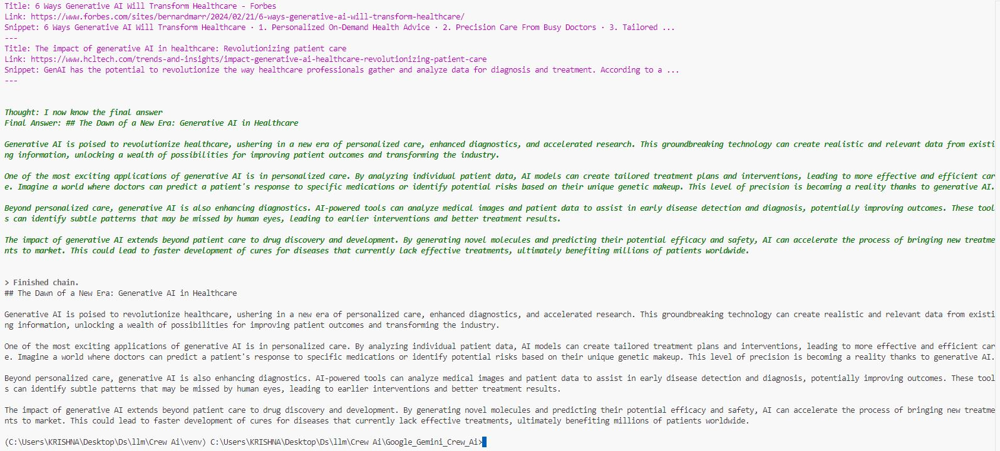

# AI Healthcare Blog Generator with Crew AI (Powered by Gemini 1.5-flash)

## Introduction

This repository showcases a project that leverages Crew AI and Google's powerful Gemini 1.5-flash language model to automatically generate engaging blog posts about AI in healthcare. The project aims to:

* **Demystify AI advancements in healthcare:** Make complex topics understandable for a wider audience.
* **Provide insightful content for healthcare professionals and enthusiasts:** Offer valuable information and trends.
* **Explore the potential of AI in healthcare:** Highlight its benefits, applications, and future implications.

## Project Structure

The project is organized into the following files:

* **agents.py:** Defines the AI agents responsible for research and writing tasks.
* **task.py:** Defines the tasks for the agents, outlining their objectives and expected output.
* **tools.py:** Includes tools like SerperDevTool to perform internet searches and gather information.
* **crew.py:** Orchestrates the crew of agents and tasks, defining the workflow.

## Setup and Installation

1. **Install Dependencies:**
   ```bash
   pip install crewai langchain_google_genai crewai_tools dotenv
Use code with caution.
Markdown
Obtain API Keys:
Google API Key: You'll need to obtain a Google API key to use Gemini 1.5-flash. You can create one at Google Cloud Platform.
Serper API Key: Sign up for a free Serper.dev account and get an API key at Serper.dev.
Create a .env File:
GOOGLE_API_KEY=YOUR_GOOGLE_API_KEY
SERPER_API_KEY=YOUR_SERPER_API_KEY
Use code with caution.
Run the Project:
python crew.py
Use code with caution.
Bash

## Usage
The crew.py file contains the main execution logic.
Modify the topic variable in crew.py to specify the subject of your blog posts.
Run the project to generate a new blog post in Markdown format.

## Example Output
The output will be a Markdown file named "new-blog-post.md" containing a blog post about AI in healthcare, based on your specified topic.

Use code with caution.
Markdown

## Contributing
Contributions are welcome! If you'd like to improve the project or add new features, feel free to fork the repository and submit a pull request.

## Acknowledgements
This project was inspired by tutorials from Krish Naik on YouTube. 
His videos were instrumental in learning the concepts and techniques used in this project.

## License
This project is licensed under the Apache 2.0 License - see the [LICENSE](LICENSE) file for details.

## Contact
If you have any questions or suggestions, please feel free to contact me.